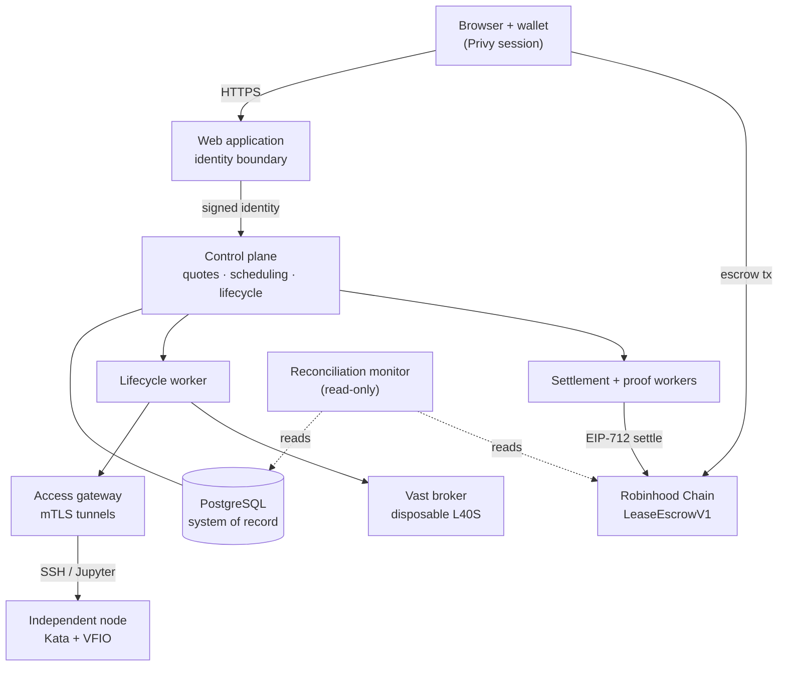
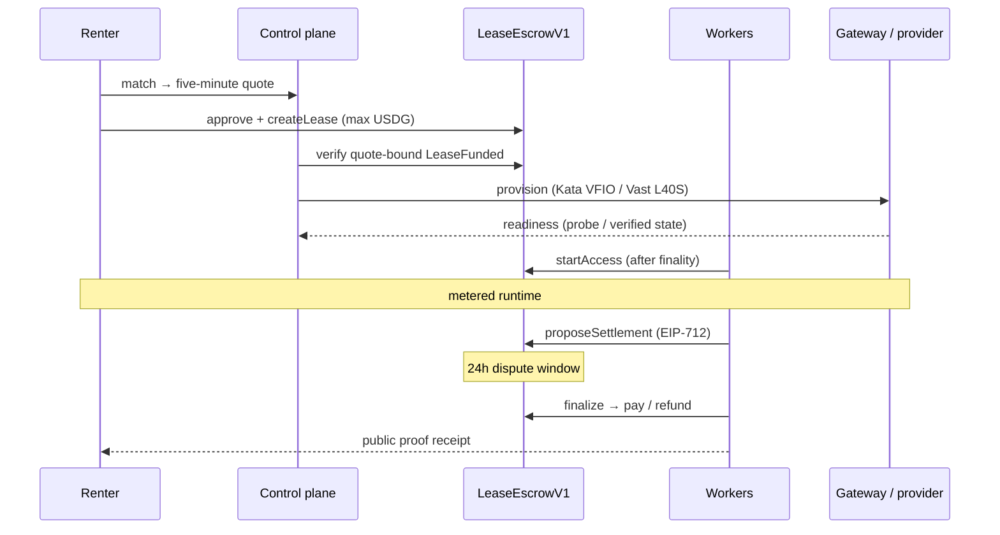

# Prism Network architecture

Prism matches renter workloads with bonded GPU capacity, escrows the cost in USDG
on Robinhood Chain, meters confirmed runtime, and settles onchain. The web
application is the only public surface; every key, credential, and terminal byte
stays behind it.

## System overview

## Trust boundaries

### Browser

The browser obtains a Privy session, links a payment wallet, and submits escrow
transactions directly to Robinhood Chain. It does not receive settlement keys,
node device keys, gateway control tokens, or provider network addresses.

### Control plane

The control plane schedules only nodes that are bonded onchain, compatible with
the requested image, and below both the node and network concurrency limits.
Physical nodes also require a recent heartbeat and independent gateway
observation. The Vast broker instead requires a fresh verified L40S offer below
its upstream cost ceiling. The control plane never receives terminal or file
data. Its authoritative offer, telemetry, account-control, and quote state lives
in PostgreSQL. The process only permits its in-memory store behind an explicit
local-development switch.

RDS manages its master password. The control plane receives a separate,
least-privilege database URL from Secrets Manager; neither credential is kept in
Terraform variables or application configuration.

### Access gateway

The gateway accepts outbound node mTLS tunnels, records fresh tunnel observations
independently, and routes short-lived lease-bound SSH or Jupyter grants through
those tunnels. Revocation terminates active relay sessions. It is the sole
service allowed to confirm that a CUDA-ready workspace has usable access before
billing starts onchain. Active probes consume fresh outbound tunnels for both SSH
and Jupyter before the lifecycle worker submits `startAccess`. The grant is
issued only after that transaction reaches finality.

### Vast broker

The Vast broker is an explicit second transport, not a virtual physical node. A
single bonded broker identity represents one concurrent L40S lease. The lifecycle
worker owns provider search, instance creation, renter SSH-key attachment,
admission, and destruction. Cloud leases return direct SSH endpoints and never
enter the node command or gateway-tunnel path. Settlement records explicit Vast
instance and cost evidence instead of signed physical node telemetry.

### Lifecycle worker

The lifecycle worker owns authoritative state transitions after provisioning. It
submits `startAccess`, rotates and revokes grants, closes interrupted or expired
leases, assembles settlement evidence, schedules finalization, and publishes
terminal receipt records. Every chain action persists signed transaction bytes,
nonce, hash, and canonical confirmation block in PostgreSQL.

### Settlement and proof workers

The settlement worker reconciles signed node telemetry with gateway timing, signs
the EIP-712 proposal and chain transaction through a non-exportable AWS KMS
secp256k1 key, and keeps a crash-recoverable submission outbox. The proof worker
independently verifies terminal chain events, publishes immutable artifacts, and
delivers the completed UTC-day X digest through a separate retrying outbox.

### Governance Safe

The deployment uses a Safe-controlled 48-hour timelock for configuration. The
Safe can pause escrow immediately and resolve a disputed settlement, but cannot
bypass the delay for routine configuration or unpausing.

### Reconciliation monitor

The reconciliation monitor is a read-only service that continuously compares the
control plane's PostgreSQL view against `LeaseEscrowV1` on chain: escrow solvency
against tracked deposits, per-lease state agreement, settlement conservation, the
active-lease bound, lifecycle liveness, and proof coverage. It holds no keys and
never mutates state — it exists so a divergence pages an operator before, not
after, money moves. See [integrity monitoring](#integrity-monitoring).

## Components

| Component | Responsibility | Writes |
| --- | --- | --- |
| `services/control-plane` | Quotes, scheduling, lifecycle API, funding confirmation | PostgreSQL |
| `services/access-gateway` | mTLS tunnels, revocable SSH/Jupyter grants, readiness probes | Relay sessions |
| `services/operations-monitor` | Operational health metrics (tunnels, certs, queues) | — (reads PostgreSQL) |
| `services/reconciliation-monitor` | Chain ↔ database integrity invariants | — (reads PostgreSQL + chain) |
| `workers/lifecycle-worker` | Provisioning, access, teardown, settlement evidence | PostgreSQL + chain |
| `workers/settlement-worker` | EIP-712 metering proposal and finalization | Chain (KMS-signed) |
| `workers/proof-worker` | Terminal-event verification and public proof publication | Proof artifacts |
| `node/prismd` | Supplier daemon: Kata/VFIO runtime, tunnels | Node host |

## Primary interfaces

- `POST /v1/nodes/enroll` registers a device-signed enrollment after checking the
  operator, payout wallet, bond, and device hash in the registry.
- `POST /v1/nodes/{node_id}/heartbeat` accepts a device-signed, monotonic status
  update.
- `GET /v1/offers` returns bonded, online, compatible public-image offers.
- `POST /v1/leases/match` returns a five-minute quote; the wallet creates the
  actual escrow directly onchain with a quote-derived client reference.
- `POST /v1/leases/confirm` verifies the finalized quote-bound funding event,
  records the renter wallet, and queues either the physical node command or
  cloud-provider launch.
- `GET /v1/leases` returns the authenticated account's indexed leases.
- `GET /v1/leases/{lease_id}/access` returns either the active account-owned
  gateway grant or the direct cloud SSH endpoint.
- `POST /v1/nodes/{node_id}/commands/next` leases a launch command to the device
  after verifying a fresh device signature.
- `POST /v1/nodes/{node_id}/commands/{command_id}/report` records signed
  readiness, completion, or failure without accepting replayed requests.
- `POST /v1/grants` is internal-only and creates a bounded SSH/Jupyter grant.
- `POST /v1/probes` is internal-only and confirms both workspace access paths
  through fresh node tunnels.
- `GET /v1/access` validates a bearer grant before tunnel routing.
- `DELETE /v1/grants/{token_id}` revokes a grant through the internal control
  credential.

The control plane must be deployed behind a Privy-verifying auth boundary. The
development identity header is explicitly disabled unless
`PRISM_ALLOW_DEVELOPMENT_AUTH=1` is set.

## Runtime lifecycle

1. The supplier posts a USDG bond and registers a device hash onchain.
2. The renter receives a quote and deposits the maximum USDG cost.
3. The control plane confirms the quote-bound funding event. A physical node
   launches a Kata sandbox with reserved VFIO; a cloud lease launches a
   disposable Vast `ssh_direct` instance.
4. Physical readiness is actively probed by the gateway. Cloud readiness is
   admitted from verified provider state, exact GPU/VRAM, cost, and SSH endpoint
   checks before billing starts.
5. Duration expiry, stale node telemetry, stale tunnel state, or a signed node
   completion closes access and creates a durable settlement job.
6. The attestor proposes signed metering. After 24 hours without dispute, the
   lifecycle worker finalizes payment/refund and queues public proof.

## Integrity monitoring

Two read-only services observe the system without holding keys or mutating state:

- **Operations monitor** (`:9091`) surfaces operational health — active leases,
  tunnel freshness, certificate expiry, queue depth, and receipt age.
- **Reconciliation monitor** (`:9092`) enforces the financial invariants that
  span chain and database. On each scrape it checks:
  - **Solvency** — escrow USDG balance covers the deposits the control plane still
    holds open.
  - **State agreement** — no lease is open in the database while already released
    on chain (the dangerous direction), and no settled lease is still open on
    chain.
  - **Conservation** — every `LeaseFinalized` event splits the deposit exactly:
    `deposit = provider_paid + fee + refunded`, with the fee at the contract's
    basis points.
  - **Bounds and liveness** — the onchain active-lease count stays within the
    network cap, and no lease stalls in provisioning, closing, or settlement past
    its timeout.
  - **Proof coverage** — every finalized lease has a receipt, and no receipt
    exists without a settled lease.

  Each check is a labeled Prometheus gauge; a breach is logged at `error` and is
  intended to page. The monitor reuses the same chain client and settlement math
  as the workers, so its view cannot silently drift from theirs.
